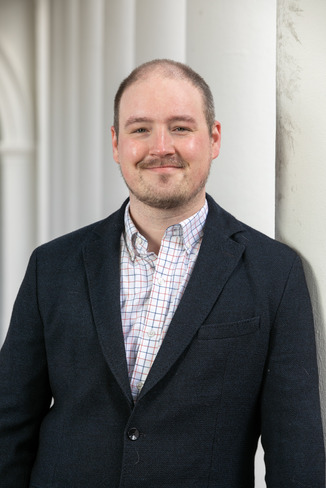

Aaron M. Thompson

    </img>
    

        
Hello! I'm Aaron, a doctoral candidate in Slavic Languages & Literatures at the University of Virginia, passionate educator, and hobbyist in open tech, fermentation, and photography.
 
        
If you're interested, there is more information about <a href="/about.html">me</a>, my <a href="/research.html">dissertation on religious thought in the Russian Empire's pre-revolutionary period</a>, creating <a href="/pedagogy.html">digital pedagogy resources</a> for second-language and cultural education, and experimentation with <a href="/research.html">Russian-language Natural Language Processing</a>.

    

